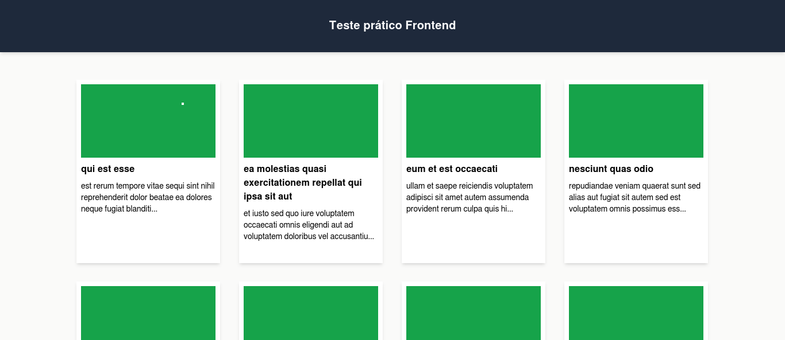

# Teste prático frontend

## Objetivo

A equipe recebeu uma demanda para desenvolver um front-end para uma API RESTful. No cenário
proposto, a interface deve exibir posts de um blog e, ao clicar em um post, os comentários
associados

## Recursos

A api utilizada foi o json placeholder. Url de base:
<code>https://jsonplaceholder.typicode.com/</code>

### Posts

-  Posts: <code>/posts</code>
-  Comments: <code>/posts/[postId]/comments</code>

## Como rodar

Para rodar basta clonar este repositório e digitar na linha de comando <code>npm install</code> e em
seguida <code>npm run dev</code>
